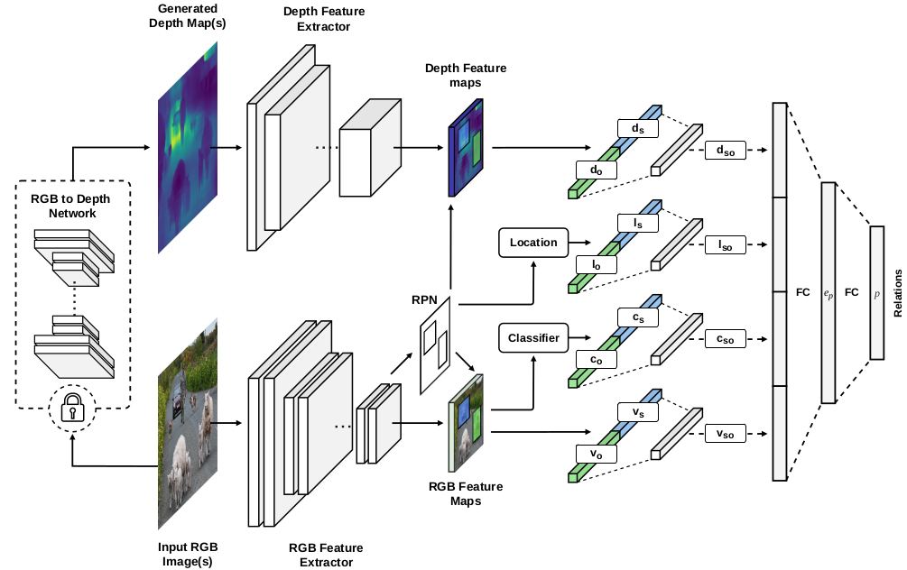
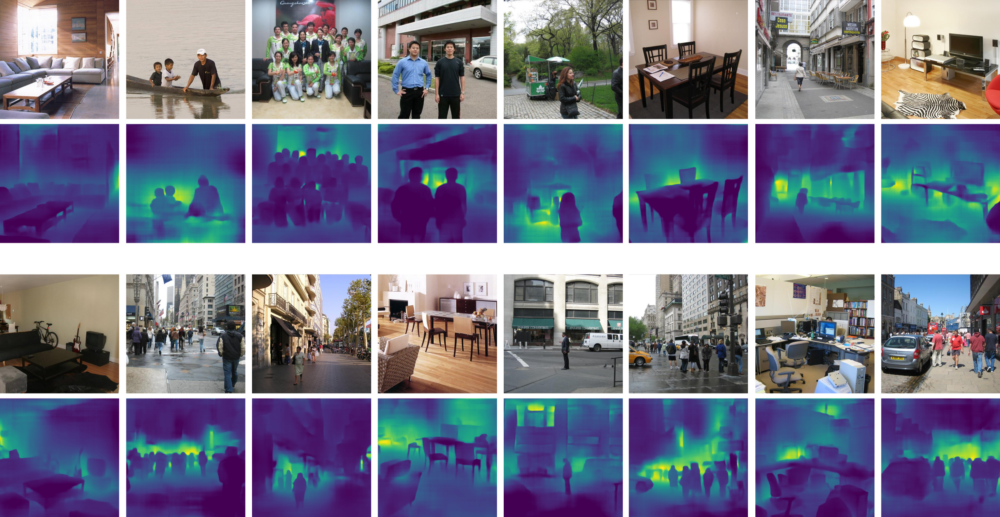
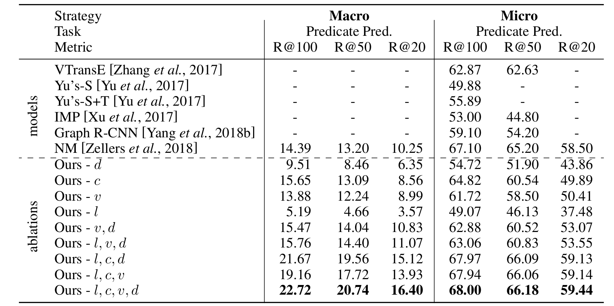
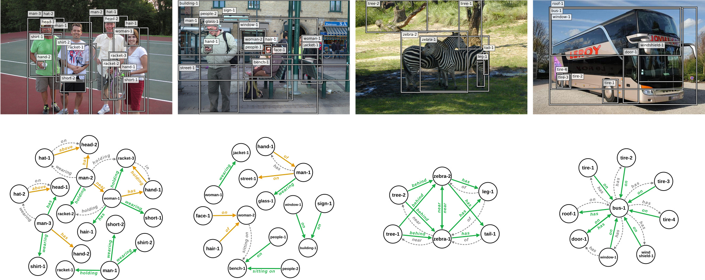

## [Improving Visual Relation Detection using Depth Maps (ICPR 2020)](https://arxiv.org/abs/1905.00966)

#### by [Sahand Sharifzadeh](https://www.dbs.ifi.lmu.de/cms/personen/mitarbeiter/sharifzadeh/index.html)<sup>1</sup>, [Sina Moayed Baharlou](https://www.sinabaharlou.com)<sup>2</sup>, [Max Berrendorf](https://www.dbs.ifi.lmu.de/cms/personen/mitarbeiter/berrendorf/index.html)<sup>1</sup>, [Rajat Koner](https://www.dbs.ifi.lmu.de/cms/personen/mitarbeiter/koner1/index.html)<sup>1</sup>, [Volker Tresp](https://www.dbs.ifi.lmu.de/cms/personen/professoren/tresp/index.html)<sup>1,3</sup>
<sup>1 </sup> Ludwig Maximilian University, Munich, Germany, <sup>2 </sup> Sapienza University of Rome, Italy<br/>
<sup>3 </sup> Siemens AG, Munich, Germany<br/>

## Abstract
State-of-the-art visual relation detection methods mostly rely on object information extracted from RGB images
such as 2D bounding boxes, feature maps, and predicted class probabilities. Depth maps can additionally provide
valuable information on object relations, e.g. helping to detect not only spatial relations, such as standing behind,
but also non-spatial relations, such as holding. In this work, we study the effect of using different object
information with a focus on depth maps. To enable this study, we release a new synthetic dataset of depth maps,
VG-Depth, as an extension to Visual Genome (VG). We also note that given the highly imbalanced distribution of 
relations in VG, typical evaluation metrics for visual relation detection cannot reveal improvements of 
under-represented relations. To address this problem, we propose using an additional metric, calling it Macro Recall@K,
and demonstrate its remarkable performance on VG. Finally, our experiments confirm that by effective utilization of 
depth maps within a simple, yet competitive framework, the performance of visual relation detection can be improved 
by a margin of up to 8\%.
## Model

<p align="center"></p>
 
## Highlights

* We perform an extensive study on the effect of using different sources of object information 
in visual relation detection. We show in our empirical evaluations using the VG dataset, that our
model can outperform competing methods by a margin of up to 8\% points, even those using external language sources or contextualization.

* We release a new synthetic dataset [<i>VG-Depth</i>](https://drive.google.com/open?id=1-BQcGwsnwS-cYHSWIAkmToSCINUnNZQh), to compensate for the lack of depth maps in Visual Genome.

* We propose <i>Macro Recall@K</i> as a competitive metric for evaluating the visual relation detection performance in highly imbalanced 
datasets such as Visual Genome.

## VG-Depth Dataset

We release a new dataset called VG-Depth as an extension to Visual Genome. This dataset contains synthetically generated depth maps from Visual Genome images and can be downloaded from the following link: [VG-Depth](https://drive.google.com/open?id=1-BQcGwsnwS-cYHSWIAkmToSCINUnNZQh)

Here are some examples of the Visual Genome images and their corresponding depth maps provided in our dataset:

<p align="center"></p>

## Results
<p align="center"></p>


## Qualitative Results
Some of the qualitative results from our model’s predictions. Green arrows indicate the successfully detected predicates (true positives), orange arrows
indicate the false negatives and gray arrows indicate predicted links which are not annotated in the ground truth.

<p align="center"></p>


## Code

### Requirements
The main requirements of our code are as follows:

>- Python >= 3.6 </br>
>- PyTorch >= 1.1
>- TorchVision >= 0.2.0 
>- TensorboardX
>- CUDA Toolkit 10.0
>- Pandas
>- Overrides
>- Gdown

### Setup
Please make sure you have Cuda Toolkit 10.0 installed, then you can setup the environment by calling the following script:

```
./setup_env.sh
```

This script will perform the following operations:

1. Install the required libraries.
2. Download Visual-Genome.
3. Download the Depth version of VG.
4. Download the necessary checkpoints.
5. Compile the CUDA libraries.
6. Prepare the environment.

If you have already installed some of the libraries or downloaded the datasets, you can run the following scripts individually: 
```
./data/fetch_dataset.sh             # Download Visual-Genome
./data/fetch_depth_1024.sh          # Download VG-Depth
./checkpoints/fetch_checkpoints.sh  # Download the Checkpoints
```


### How to Run

Set the dataset path in the config.py file, and adjust your PYTHONPATH (e.g. export PYTHONPATH=/home/sina/Depth-VRD).

To train or evaluate the networks, select the configuration index and run the following scripts:
(e.g. to evaluate "Ours-v,d" model run ./scripts/shz_models/eval_scripts.sh 7)
 
* To train the depth model separately (without the fusion layer): 
```
./scripts/shz_models/train_depth.sh <configuration index>
``` 
* To train each feature separately (e.g. class features): 
```
./scripts/shz_models/train_individual.sh <configuration index>
``` 
* To train the fusion models: 
```
./scripts/shz_models/train_fusion.sh <configuration index>
``` 

* To evaluate the models: 
```
./scripts/shz_models/eval_scripts.sh <configuration index>
``` 
The training scripts will be performed for eight different random seeds and 25 epochs each. 


## Checkpoints 

You can also separately download the full model (LCVD) [here](https://drive.google.com/open?id=1ZkHseT3zA2bk1CBxJ6fhI18GuqwUIAwM). Please note that this checkpoint generates results that are
slightly different that the ones reported in our paper. The reason is that for a fair comparison, we have reported the mean values from evaluations over several models.

## Contributors

This repository is created and maintained by [Sahand Sharifzadeh](https://github.com/sharifza), [Sina Moayed Baharlou](https://github.com/Sina-Baharlou), and [Max Berrendorf](https://github.com/mberr).

## Acknowledgements

The skeleton of our code is built on top of the nicely organized [Neural-Motifs](https://github.com/rowanz/neural-motifs) framework (incl. the rgb data loading pipeline and part of the evaluation code). 
We have upgraded these parts to be compatible with PyTorch 1. To enable a fair comparison of models, our object detection backbone also uses the same Faster-RCNN weights as that work.

## Bibtex
```
@misc{sah2019improving,
    title={Improving Visual Relation Detection using Depth Maps},
    author={Sahand Sharifzadeh and Sina Moayed Baharlou and Max Berrendorf and Rajat Koner and Volker Tresp},
    year={2019},
    eprint={1905.00966},
    archivePrefix={arXiv},
    primaryClass={cs.CV}
}
```
